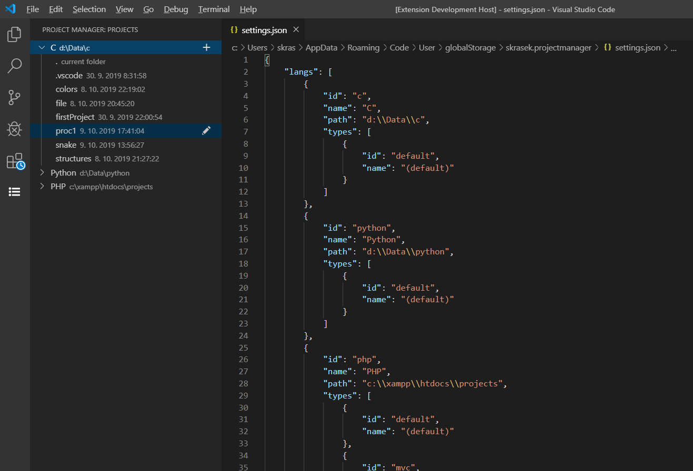
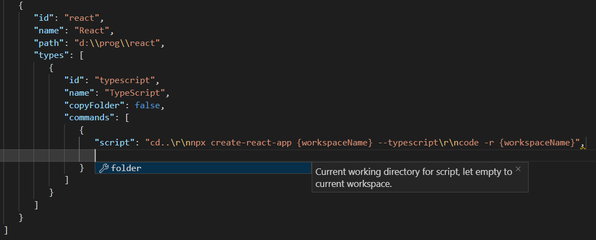

# Project manager

Extension for managing folders for project and rendering templates for different project types. 

Manually changing settings:  

## Commands

- Open configuration file
  `projectmanager.config`
  `Project manager: Config`

- Create new project
  `projectmanager.createProject`
  `Project manager: New project`

- Rename project
  `projectmanager.renameProject`
  `Project manager: Rename project`

- Delete project
  `projectmanager.deleteProject`
  `Project manager: Delete project`

- Open project
  `projectmanager.openProject`
  `Project manager: Open project`

- Add folder for projects of specific language
  `projectmanager.addLanguage`
  `Project manager: Add language`

- Remvoe language
  `projectmanager.removeLanguage`
  `Project manager: Remove language`

- Create new template for language
  `projectmanager.createTemplate`
  `Project manager: New template`

- Open folder with template
  `projectmanager.editTemplate`
  `Project manager: Edit template`

- Delete template
  `projectmanager.deleteTemplate`
  `Project manager: Delete template`
